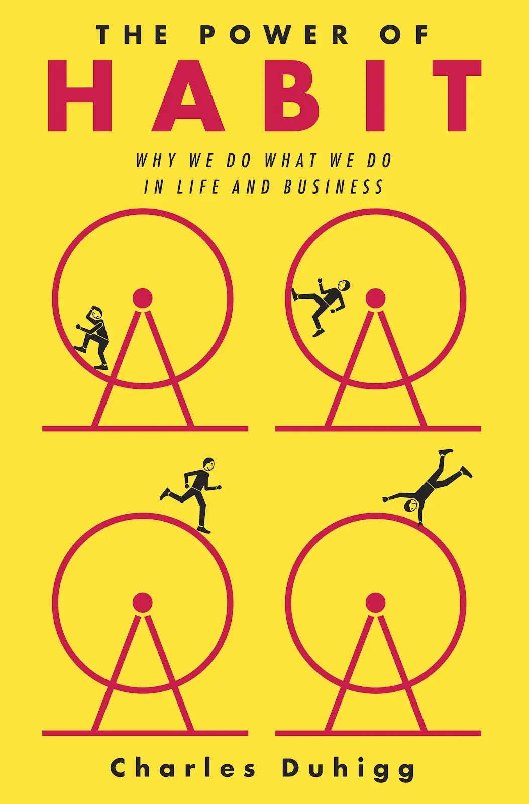
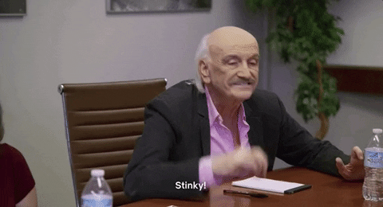
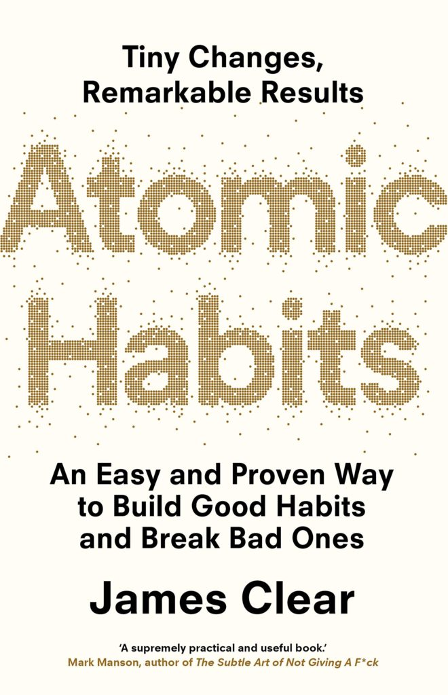
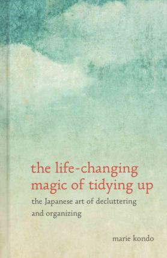
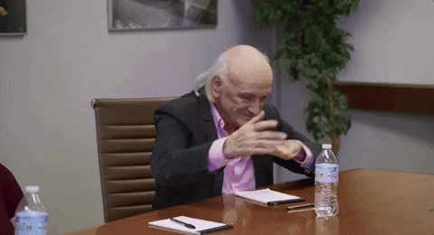
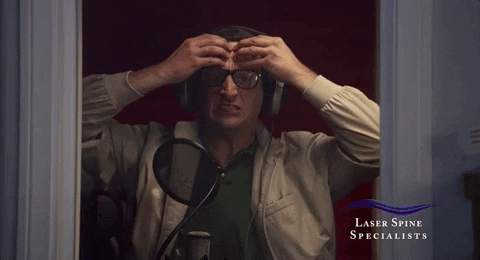
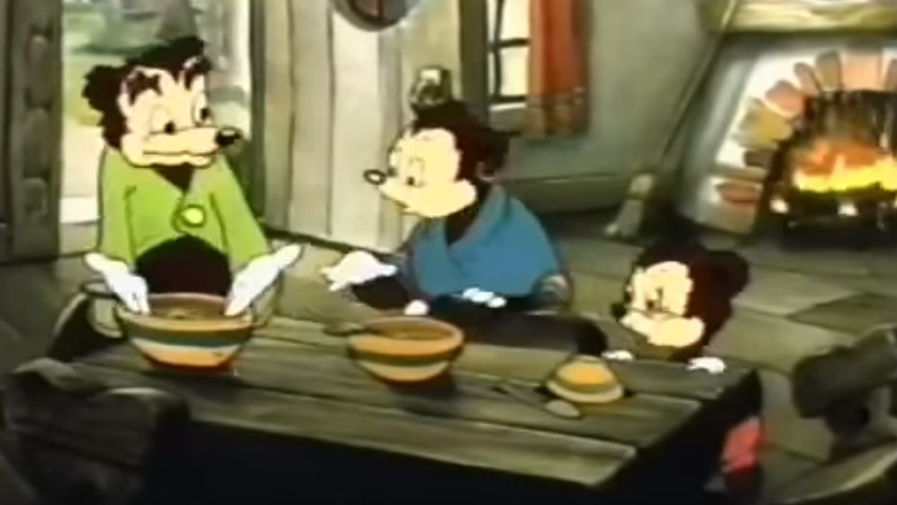
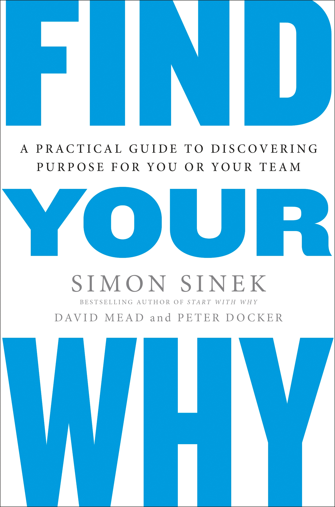
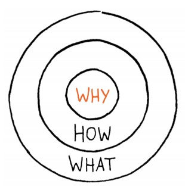
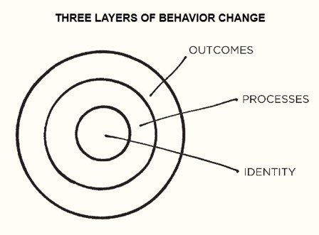

# **Exploit Your Brain!**

Habits at Work and in Life

---

# Agenda

* Background–Science of Habit
* How do they work?
* The laws of behavior
* Tactics for Building or Breaking
* Discovery, Disruption, and Rebuilding

---

Patrick McVeety-Mill "is"
# Loud & Abrasive

he/him

likes 🥾 ⛺ 🎶 🏊‍♂️ 🎨 🍻 🤙

Engineering Manager at **Accenture**

@pmcvtm
@loudandabrasive

---

# Background

_by the book_

---

# The Power of Habit
_by Charles Duhigg_

* behavioral science through the lens of consumerism

* the **Habit Loop**
* the **Golden Rule** of Habit Change
* pattern-changing **keystone habits** to kick things off

---

---

# Atomic Habits
_by James Clear_

* thoughtful techniques atop a foundation of existing science

* the **Laws of Behavior**
* **awareness** of habits
* the power of **identity** over habits

---

# The Life-Changing Magic of Tidying Up
_by Marie Kondo_

* practices for discarding
* a place for every thing
* (has a tv show)

---

---

---

# Science of Habits

_what and how_

---

# How Do Habits Work?

_things we don't know we are doing_

---

# The Habit Loop

* four distinct steps:
  * cue
  * craving
  * response
  * reward

+ constant, instantaneous, and unavoidable
+ driven by the animal brain

---

# Atomic Habits

* the smallest piece of a behavior
* habits have a compounding incremental impact
  * positive (improvement, building)
  * negative (worsening, intensifying)
* the system is more powerful than the goal

---

# Outcomes &middot; Process &middot; Identity

* outcomes are results we strive for
* process is how we implement change
* identity is self-perception and worldview

* driven by **evidence** and **belief**
* habits and identity are **self-reinforcing**

---

# Laws of Behavior
_what make a strong habit (good or bad)_

---

# 1. Obvious (Cue)

* practiced habits are **automatic**
* cue triggers are most often **time and location**
* **environment** compounds thought when decision-making
* **context** can amplify or eliminate inclinations to act

* behavior change requires **awareness**

---

# 2. Attractive (Craving)

* we are constantly driven by stimuli
* **supernormal stimuli** exist outside our caveman brain behavior
* we **imitate group norms** of the close, the many, and the powerful

* motives are a **dopamine-driven** feedback loop
* response is to anticipation **not fulfillment**

---

# 3. Easy (Response)

* building habit requires **repetition** not time or improvement
* being **in motion** is not necessarily **progress**
* _the best is the enemy of the good_

* habits that require the **least effort win**
* one habit will very often **flow into the next**

---

# 4. Satisfying (Reward)

* _what is rewarded is repeated, what is punished is avoided_
* our brains **inconsistently** evaluate rewards across time
* our environment is built around **delayed returns**

* strong habits are **positive experiences**
* kind and amount of satisfaction can be inconsequential

---

# Tactics
_approaches for building or breaking_

---

# Invert the Laws

1. Cue: ~~obvious~~ **invisible**
1. Craving: ~~attractive~~ **unattractive**
1. Response: ~~easy~~ **difficult**
1. Reward: ~~satisfying~~ **unsatisfying**

---

# The Habit Scorecard

## Understand What You're Doing Unconsciously

* catalog **every** habit along your day
* rate them:
  * 〰 neutral
  * ✔ good
  * ❌ bad
* ratings are **subjective**

---

# The Habit Scorecard

## Morning Routine

* Wake up ◻
* Snooze alarm ◻
* Wake up again ◻
* Turn off alarm ◻
* Go to the bathroom ◻
* Shower ◻
* Brush my hair ◻
* Brush my teeth ◻

---

# The Habit Scorecard

## Morning Routine

* Wake up 〰
* Snooze alarm ❌
* Wake up again 〰
* Turn off alarm ✔
* Go to the bathroom 〰
* Shower ✔
* Brush my hair ✔
* Brush my teeth ✔

---

# The Habit Scorecard

## Get to Work

* Log on to computer 〰
* Check email ❌
* Check my notes ✔
* Check Twitter ❌
* Read team Slack channel 〰
* Read memes Slack channel ❌

---

# Habit Stacking

## Combine and Order Habits to Work Together

* use one habit as a cue for another
  * _after I finish eating, I wash the dishes_
* move bad habits to be rewards
  * _after I submit my pull request, I can check Twitter_
* pair good habits with cravings
  * _after I start my coffee brew, I stretch while I wait_
* apply **the golden rule of replacement**
  * _when I want a chocolate bar, I will a carrot_

---

# Keeping Tidy

## Make Your Space Work for Your Habits

* a dedicated place for **every thing**
  * clear all boxes and empty all bags
* interactions with things are **rituals**
* don’t clean… **reset**
* use object placement
  * set up cues for activities to be **obvious**
  * reduce friction to make actions **easy**
* eliminate the option for bad habits

---

# Inevitables and Impossibles

## One-Time Steps That Guarantee Change

* put away leftovers before eating
* set up automatic bill pay
* get a pet
* remove the TV from the bedroom
* filter or unsubscribe from emails
* uninstall an app from your phone

---

# Discovery, Disruption, Rebuilding

➡ ➡ ⤴ ⬅ ⤵ ⬆

---

# Discovery

_understanding your identity_

---

# Habits and the Self

## Finding the Right Habits

* what **"work" feels like fun** to me?
* what makes me **lose sense of time**?
* what **comes naturally** to me?

* keep habits right on the edge of too challenging

---

# Habits and the Self

## Go Deep on Identity

* think of and share stories
* identify themes
* craft a "why statement"
* articulate "how" and "what"

---

<!-- images -->

---

# Creating Routines

## imagine your ideal life...

* what do you do when...
  * you wake up?
  * you get home or stop working?
  * you are expecting guests?
* make your space **conducive** to those behaviors

---

# Disruption

_when things don't work or change_

---

# Creating Routines

## Coming Home

* put on music
* take off shoes
* maybe have a snack
* make something
* eat dinner
* (free time)
* reflect before bed and the next morning

---

# Creating Routines

## At Home

* record player is by the door
  * so is the shoe cupboard
* empty my backpack
  * journal goes to kitchen table
* sliced veggies in the fridge
* desk is set up for arts & crafts
  * (computer games require setup)

---

<!-- panic -->

---

# Rebuilding
_habits are a loop_

---

# Situation Invention

## Start with Cues

* new cues can be **fabricated** in the absence of the old
  * invent a commute
  * fake schedule / timing
* ritualize almost everything
  * intentionally place, remove, rearrange
* **cast logic aside** (within reason)

---

# Reflect, Readjust, Repeat

## Brain Exploit Loop

* be **reflective** – learn as you go
* be **forgiving** – nothing is a failure
* **don’t** compare – you are unique
* use **rewards** – enjoy the process

---

# Questions

- Habit Science
  - the laws of behavior
- Tactics
  - inverted laws, scorecard
  - stacking, spaces
- Discovery & \[Re-\] Building
  - lean into identity
  - build routines
  - invent cues
  - 🔁

---

# Thank You!
