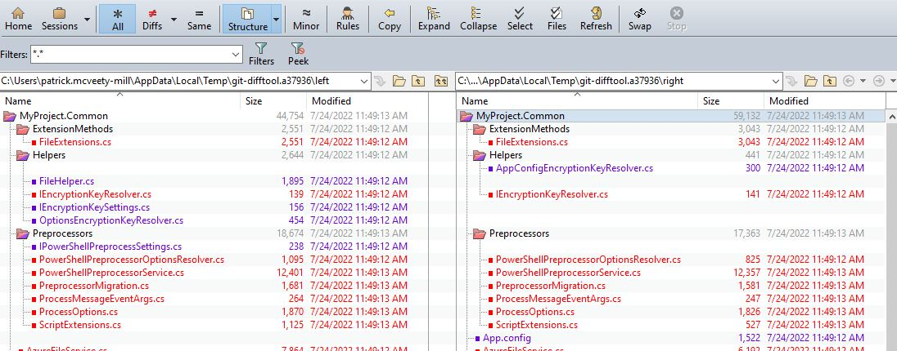
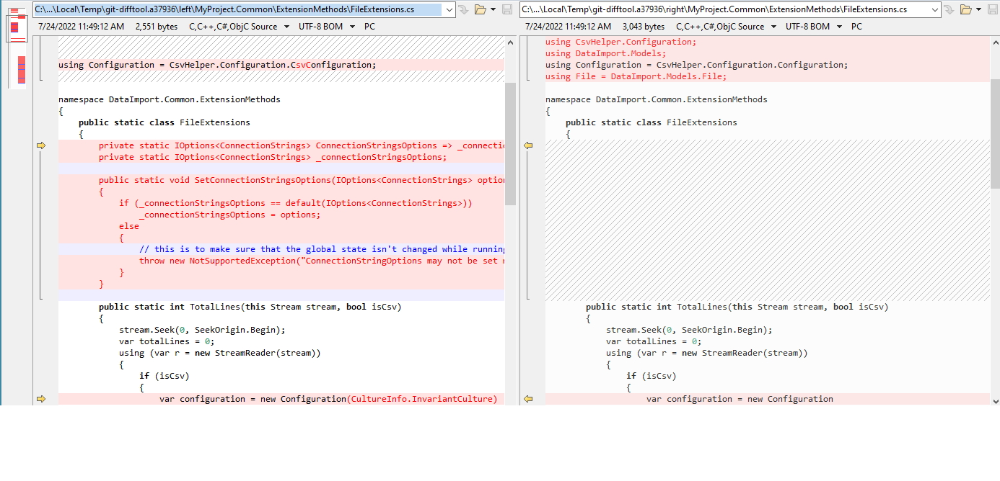
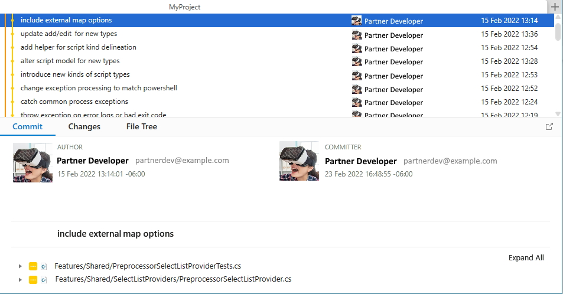
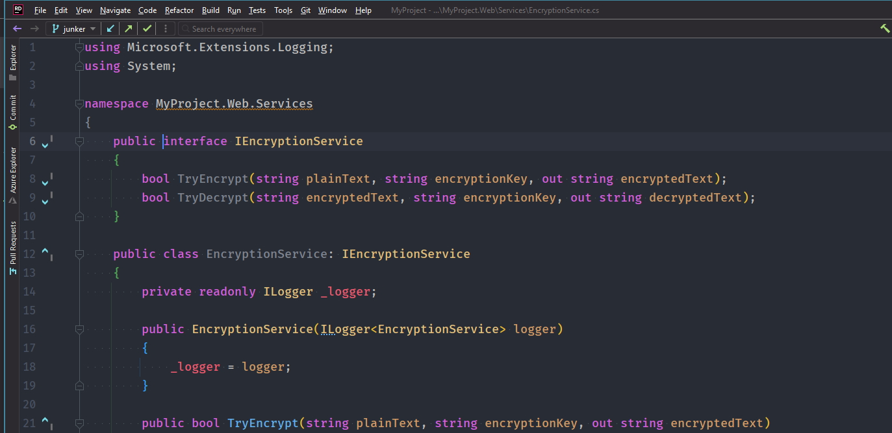

---
title: 'The 800 File Gorilla: Lessons from Reviewing a Very Big Pull Request'
theme: simple
revealOptions:
  transition: none
  controls: false
  progress: false
  navigationMode: linear
css:
- overrides.css
- atom-one-dark-reasonable.min.css
---

# The 800 File Gorilla
_Lessons from Reviewing a Very Big Pull Request_

---

<!-- .slide: data-background-color="#4C3957" -->

- pr principles
- big pr
- feedback
- lessons & tools
- questions
<!-- .element: style="color:#F8FAF6" -->

---

<!-- .slide: data-background-color="#dbd1b3" -->
<!-- .slide: data-transition="slide" -->

Patrick McVeety-Mill "is" <!-- .element: style="color:#5a3d2b;font:oblique 1em 'Vibur', sans-serif" -->
<br />**Loud & Abrasive** <!-- .element: style="color:#5a3d2b;font:normal 1.4em 'Bungee Shade', cursive" -->

- he/him <!-- .element: style="color:#e73602" -->
- likes 🥾 ⛺ 🎶 🏊‍♂️ 🎨 🍻 🤙 <!-- .element: style="color:#e5771e" -->
- Engineering Manager at <!-- .element: style="color:#87842c" --> **Accenture** <!-- .element: style="color:#cf47ff" -->
- `@pmcvtm` <!-- .element: style="color:#2a9d8f" -->
- `@loudandabrasive` <!-- .element: style="color:#264653" -->

---

<!-- .slide: data-background-color="#70A37F" -->

## Pull Request Principles <!-- .element: style="color:#F8FAF6" -->

---

❓ Sidebar: _What is a Pull Request?_

- "let me merge my code into yours"
- typically involves gate-checks + review


Note: In source control, you have a mainline of code changes (or sometimes more than one) that developers "branch" off of to make changes without stepping on each others toes. When the work is done, they merge it back into mainline, but while it _can_ be merged directly, more often it goes through some review and checks first: A Pull Request.

---

📎 well-organized

- code is reasonably grouped
- scope of effort is defined and right
- related changes mostly

Note: As a starting point, it helps if your code is well organized, by project but also function or feature. It's important that the scope of the PR is defined up-front, and ideally "right-sized" between so small it's annoying and so big it's difficult to review.

---

📝 well-documented

- includes high-level description
- commits tell story of approach
- issue, ticket, or documentation for more

Note: Good PRs should include a description of the change, as well as steps to test or remarks about it. This can either be as comments or as a description that may roll-up into a commit message at the end. Speaking of commits, ideally they are incremental and can tell a story about the process, or at least makes parts of the work easy to see separately. Finally it can help to have extra documentation in the form of a linked issue or ticket, or maybe on a docs site if there's more design in play.

---

💭 well-considered

- planned before opening
- open for discussion
- _pragmatism_ over _dogmatism_

Note: PRs are planned out either through issue listings or discussion between contributor and maintainer; and they are open to more discussion after opening. Ultimately decisions that we make as part of the PR or during review are more pragmatic than they are perfectionist.

---

👓 well-reviewed

- thorough - high and low level
- code is efficient & matches style
- tested: **functionality over all**

Note: Review of PRs, even for the most experienced and trusted authors, needs to be thorough - both at conceptual and detailed levels. We want to make sure the code is well-written, efficient, and matches our existing codebase. Most importantly, and this is something some lose sight of, that the code behaves as expected, doesn't introduce any regressions.

---

💖 have empathy

for author, reviewer, and readers

---

<!-- .slide: data-background-color="#70A37F" -->

## The Big PR <!-- .element: style="color:#F8FAF6" -->

---

<!-- .slide: data-background-color="#4E7AA6" -->

### Background <!-- .element: style="color:#F8FAF6" -->

---

🔙 Lay of the Land

- open source software provider
- most contributions are from their team
- this pull request came from a partner

Note: I was working with an open source software provider, who has a community of implementors that use it and some collaborative partners. But like many OSS projects, contributions mostly are from their team. This PR came from one of those partner orgs.

---

👭 Partner History

- had delivered large changesets
- reasonable success in the past
- semi-rotating cast of developers

Note: This partner has worked with the client before, for large changes like frameworks upgrades and feature overhauls. And they went pretty OK. The changes went through - some collaborations were smoother than others - and there were some lessons along the way, particularly about the size of PRs and how to make incremental changes over time. But they're a company too, with teams assigned to different efforts, so they move around, which meant there wasn't continuity on those lessons between efforts.

---

👋 Starting point

- I joined as new lead with effort underway
- _somewhat_ collaborative rhythms:
  - weekly syncs + questions chat
  - lighter touch than client dev team
- initial plan for smaller chunks had snowballed

Note: Communication was less frequent than as with dev team; our team wasn't _owning_ that effort, but would support the outcome from it. Things were going **OK** but it had become clear the initial hope of several medium-sized PRs was a dream long gone. The changes in question had snowballed to the tune of a changeset of 900 files.

---

<!-- .slide: data-background-color="#4E7AA6" -->

### Process <!-- .element: style="color:#F8FAF6" -->

Note: Now that we're in this situation, how do we go about it?

---

<!-- .slide: data-background-color="#414073" -->

#### 1. Accept Your Fate <!-- .element: style="color:#F8FAF6" -->

Note: In a reverse on the stages of grief, the first step is acceptance.

----

<!-- .slide: data-background-image="https://media3.giphy.com/media/l0Iy2MPfW2jmXeLgA/giphy.gif?cid=790b761103740f3d151646b6c893b6ad6984aea3ecde9edd&rid=giphy.gif&ct=g" -->

Note: Look yourself in the mirror and say "This is happening"

---

<!-- .slide: data-background-color="#414073" -->

#### 2. Assess the Scene <!-- .element: style="color:#F8FAF6" -->

Note: Before we dig in to actually reviewing the PR, we should see what's up at a high level, and then plan our excavation.

---

Create a list of all changes between PR and main

<!-- data-line-numbers="" -->
```shell [1|3-13]
$ git diff --name-status main >> ./pr-files.txt

M  .gitignore
A  .vscode/settings.json
M  MyProject.Common.Tests/MyProject.Common.Tests.csproj
M  MyProject.Common.Tests/PowerShellPreprocessorServiceTests.cs
M  MyProject.Common.Tests/ScriptExtensionsTests.cs
D  MyProject.Common.Tests/app.config
D  MyProject.Common.Tests/packages.config
D  MyProject.Common/App.config
M  MyProject.Common/AzureFileService.cs
R092  MyProject.Web/script.js  MyProject.Web/wwwroot/script.js
:
```

Note: Chances are your code repository's website will crash if you start looking at files in the browser. Thankfully, this is easy with git. We can ask the repo what's different and spit it out as a text file.

---

📊 Dump that text into a spreadsheet and then:

- sort by change <!-- .element: class="fragment" --> (**A**dd,**M**odify,**D**elete,**R**ename)
- sort by 'project' <!-- .element: class="fragment" -->
- pull out readable filenames <!-- .element: class="fragment" -->

Note: Uses Excel's `LEFT=` and `SEARCH` to pull out project names, then `RIGHT` for the file.

----

![Spreadsheet listing file diff with columns [git] "Change", "Full Name", the calculated "Project" name and short "Filename"](assets/diff-spreadsheet.jpg)

Note: There's _a lot_ we are going to do with this! Most importantly we should save this twice, once for posterity and then once again to edit as needed.

---

✅ Translate into a Checklist

```markdown [|1|3-6]
## MyProject.Common

- [ ] Helpers/FileHelper.cs
- [ ] Helpers/IEncryptionKeySettings.cs
- [ ] Helpers/OptionsEncryptionKeyResolver.cs
- [ ] Spreadsheets/GridFormatter.cs
...
```

Note: One of the first things we can do is break out a checklist for ourselves to take notes on.
I broke this out to a markdown file.. we'll see why in a bit, and I pulled out each list of files per project, and did some Find/Replace magic to add the checkbox in front of each. You could also do this as another row in Excel if you're more comfortable with that.

---

👃 Look for Smells

- `R100`
  - directory renames
  - file exoduses
- **A**dd + **D**elete with similar names
- big chunks of **A**dds
- **C**opy changes

Note: We first look for quick things to either throw out, or flag to look at more closely.

Renames show as `R` + the percent difference.  Are these 100%s necessary? Sometimes, but not often. We can assume that we can breeze past reading them when they are needed, since they haven't changed. We also note files that we should _not_ gloss over.

---

<!-- .slide: data-background-color="#b02810" -->

🛑 Stop!

Leave life-easing feedback before proceeding

> &nbsp; &nbsp; **pmcvtm** commented at 10:11 am
>
> Hello 👋 I have started review on this PR and noticed that:
>
> -
>   - [ ] `ProjectX` was renamed to `ProjectY`
>   - [ ] all source files were moved into a new folder
>
> Would you mind renaming and moving those **back** to cut down the diff? We can restore them in a follow-up.
>
<!-- .element: class="pr-comment" -->

Note: Getting ahead of this will make the rest of the review easier. For my situation, the PR went from almost 900 files to 600. Still big, but smaller.

We're also being very deliberate about how we lay this message out, and will dig into that a bit later. But first we're almost done charting a course for our more detailed review.

---

<!-- .slide: data-background-color="#414073" -->

#### 3. Disappear and Review <!-- .element: style="color:#F8FAF6" -->

Note: It's time to disappear for weeks and actually review the code!

---

🍴 Dig In!

- copy spreadsheet to new list
- project by project, file by file
- address additions / deletions, then edits

Note: Begin the tedium, going programmatically through parts of the changeset, by project then files. When looking at the code we can quickly assess additions and deletions, or at least note them before re-examining them in another context, before looking at each actual modified piece of code.

---

🔎 Examine the Modified Code

```shell
$ git difftool -d main MyProject.Common
```
 <!-- .element: class="fragment" -->

Note: We can use git to open a nice tool for identifying the differences in the changeset. There are lots of good ones out there, I use BeyondCompare. Hopefully yours has an "expand all" option, and hopefully too they show up in the same order as our checklist. And this is really where the meat of the work starts.

---

🐛 Check for Quality and Behavior

- read through edits looking for **critical** differences
- quickly note format or style issues
- manually test related features before moving on

Note: We can now look through each file diff for the changes _that matter_. Look for functional changes, try to get an understanding, and quickly note and move past any style or non-functional changes.

Most important too is that while we go through code, we are manually testing functionality as we go. It doesn't matter if the code _looks_ right, or nicer even, if the behavior isn't as expected.

---

🧰 Use All Your Tools

- don't get stuck viewing diffs
- leverage features to paint a picture
- use what you know

Note: We may be switching here between the Diff Tool, "final" code to get highlighting and navigate easier, git tool for commit history... Maybe you're looking at these diffs in a fancy IDE to reduce switching. I wasn't using Rider at the time but I think it would be pretty good at this.

----

Start with the file diff



Note: This is the bread and butter of reviewing files - try to use one that diffs whitespace differently than other changes.

----

See historical context in git



Note: We can look in our favorite Git GUI to see how this file changed over time or what the thought process behind a change was

----

Navigate and analyze code



Note: Use your IDE to look at code more deeply, especially when it's new. Some applications may allow you to do all these things from the same app, so if that fits for you, do it.

---

📝 Track and Note in Your Checklist

```markdown [|3|4-5|6-8|9-10|]
## MyProject.Common

- [x] Helpers/FileHelper.cs
- [x] Helpers/IEncryptionKeySettings.cs
  - [ ] L11-12 private member formatting
- [x] Helpers/OptionsEncryptionKeyResolver.cs
  - [ ] Unit tests not translated
  - _How is this registered?_
- [x] Spreadsheets/GridFormatter.cs
  - [ ] Broken for .csv
```

Note: So here's where it was nice to have my checklist as a text document: I can now add sub-bullets for each item that needs addressing, or when there's a note to look at something else. You could still use Excel for this, but since this is Markdown, it will be easy to plug into the repository's website for formatting.

---

<!-- .slide: data-background-color="#414073" -->

#### 4. Give Feedback <!-- .element: style="color:#F8FAF6" -->

---

😈 Tell the author how they did:

> &nbsp; &nbsp; **pmcvtm** commented at 6:28 pm 34 days later
>
> Hi again 👋 sorry it's been a month. Here's my review:
>
> ⛔ **REJECTED NEEDS FIXES** ⛔
>
> There are **lots** of changes we need to do before this merges.
>
> I will follow up but closing for now, thanks. 😉
<!-- .element: class="pr-comment" -->

Note: As expected, there were lots of things to fix. But this is **not** the way we want to communicate that out.

---

<!-- .slide: data-background-color="#70A37F" -->

## Feedback <!-- .element: style="color:#F8FAF6" -->

Note: Let's talk about what **would** be a good way to deliver this feedback. Some of this is for big PRs especially, but others are more general.

---

🔁 Be incremental

- don't wait until the end
- file-by-file, **project-by-project**
- catch patterns and give a heads up

Note: Like a lot of "agile" processes, giving _pieces_ of feedback as you go is nicer for the dev (probably, or they can decide to wait if that's their style) and allows you to set a stage for them for what they might expect. If you see something repeating, let them know that it will need to be fixed in other places, too.

---

✅ Be specific and actionable

- list files and line numbers
- allow author to indicate resolution
- explain your reasoning when you can

----

🤏 Small PRs can use repository in-line tools


Note: These days most repository services allow you to leave feedback directly in-line when something is directly to a bit of code (as well as general comments too.)

----

💬 which support discussion + resolution 


Note: They also support replies (or reactions) which are more convenient than top-level comments and quotes. They even have a way to close out a conversation / feedback item as resolved

----

<!-- .slide: data-background-image="https://media2.giphy.com/media/1Be4g2yeiJ1QfqaKvz/giphy.gif?cid=ecf05e47qu8i9h1xdt7fgy24efjjv4aiiqpdp94o50jgwoi1&rid=giphy.gif&ct=g" -->

Note: That's really cool in theory, but in practice these websites can't handle displaying a diff of 600-900 files at the same time, or allow you to search through them. There's no telling how it might fail to render comments and replies on howevermany of those, too.

---

🔝 Feedback as Top-Level Comment

> &nbsp; &nbsp; **pmcvtm** commented at 2:26 pm
>
> ### MyProject.Common
>
> - `Helpers/IEncryptionKeySettings.cs`
>   - [ ] L11-12 private member formatting
> - `Helpers/OptionsEncryptionKeyResolver.cs`
>   - [ ] Unit tests are not translated over. Even though this is used a little differently in the new
>   - framework, we want to preserve the previous test coverage. Let me know if you want to go over anything.
>   - [ ] Also, I noticed this service is registered with `SpecialServiceRegistrar`, would using `AlternativeServiceRegister` work instead? 
<!-- .element: class="pr-comment" -->

Note: So instead, we do what we can with top-level comments.

Here's an excerpt of what our comment might look like. We have the files listed out, with the feedback listed under each, including the line number when possible. We're using markdown checkboxes so the author can share their progress as they go without needing to add new comments every time.

The first item in the list is a pretty straightforward "TODO" but the others have a bit more explanation, which is hopefully a cue to open discussion, and maybe get ahead of any questions or pushback.

---

🔢 Prioritizing with [MoSCoW](https://en.wikipedia.org/wiki/MoSCoW_method) (MuSh CouWt?)

- **MUST** do before merging
- **SHOULD** do or create debt
- **COULD** do to be nice
- **WON'T** do even if we'd like

also **QUESTION** and **COMMENT**

Note: Instead of just listing out all feedback equally, we can specify the importance of resolving each item. 

----

🔡 Comments with `MuSh CouWt`

> &nbsp; &nbsp; **pmcvtm** commented at 2:26 pm
>
> ### MyProject.Common
>
> - `Helpers/IEncryptionKeySettings.cs`
>   - [ ] SHOULD: L11-12 private member formatting <br/>
> - `Helpers/OptionsEncryptionKeyResolver.cs`
>   - [ ] MUST: Unit tests not translated over. Even though this is used a little differently in the new framework, we want to preserve the previous test coverage. Let me know if you want to go over anything.
>   - [ ] QUESTION: When this is registered, can we use `AlternativeServiceRegister` instead of `SpecialServiceRegistrar`?
<!-- .element: class="pr-comment" -->

Note: Here's an excerpt of what our comment might look like. We have the files listed out, with our prioritized actions under each. We're using markdown checkboxes so the author can share their progress as they go without needing to add new comments every time.

---

❎ Marking Progress

> &nbsp; &nbsp; **pmcvtm** commented at 2:26 pm
>
> ### MyProject.Common
>
> - `Helpers/IEncryptionKeySettings.cs`
    >   - [x] SHOULD: L11-12 private member formatting <br/>
> - `Helpers/OptionsEncryptionKeyResolver.cs`
    >   - [x] MUST: Unit tests not translated over. Even though this is used a little differently in the new framework, we want to preserve the previous test coverage. Let me know if you want to go over anything.
>   - [ ] QUESTION: When this is registered, can we use `AlternativeServiceRegister` instead of `SpecialServiceRegistrar`?
<!-- .element: class="pr-comment" -->

---

🔲 Track against _your_ notes too

```markdown [|5|10|7]
## MyProject.Common

- [x] Helpers/FileHelper.cs
- [x] Helpers/IEncryptionKeySettings.cs
  - [x] L11-12 private member formatting
- [x] Helpers/OptionsEncryptionKeyResolver.cs
  - [?] Unit tests not translated
  - ~~How is this registered?~~
- [x] Spreadsheets/GridFormatter.cs
  - [ ] Broken for .csv
```

Note: We can also track progress in our notes, too. So here we've marked off that the private member formatting is fixed. The `csv` file bug hasn't been resolved, and here's the important one: The unit test translated is _reported_ to have been completed, but we don't see it. So we can follow up there.

---

😩 Say "when" (softly)

- give tricky issues back to internal team
- be honest and kind with contributor
- epic/release branches are your friend

Note: There may be some issues you find which require too much technical expertise or domain knowledge to fix. That's OK; don't delay the PR further to get it done, but don't lie to the author about issues being present, either

----

> &nbsp; &nbsp; **pmcvtm** commented at 2:26 pm
>
> ### MyProject.Common
>
> - `Helpers/IEncryptionKeySettings.cs`
>   - [ ] SHOULD: L11-12 private member formatting <br/>
> - `Helpers/OptionsEncryptionKeyResolver.cs`
>   - [ ] MUST: Unit tests not translated over. Even though this is used a little differently in the new framework, we want to preserve the previous test coverage. Let me know if you want to go over anything.
> - `Spreadsheets/GridFormatter.cs`
>    - [X] COMMENT: I noticed that the Grid Formatter is not working with csv uploads.
>    - I filed a bug to follow up and fix that after this merges. 
<!-- .element: class="pr-comment" -->

---

🤝 Be diplomatic

- OSS is **publicly viewable**
- don't scare contributors off
- use thoughtful communication channels

Note: It's important to be diplomatic with contributor feedback, especially when trust hasn't been built like it may have been with your internal dev team. Also, PRs are publicly visible, and don't include anything about relationships, past discussions, or other context that may inform your communication. Don't scare folks off... Personally I am not a fan of closing PRs without extra communication, even though it is easy. Also it's important to _own up_ when you goof! We're all only human.

---

😅  Own up to _your_ errors

> &nbsp; &nbsp; **pmcvtm** commented at 4:39 pm
> 
> \> _**partnerdev** commented:_
> _The framework removed that helper, so this service was introduced to shim features X and Y, but feature Z did not need it so we removed it instead._
>
> Ah, that makes sense, thank you for explaining. Let's keep it as-is.
<!-- .element: class="pr-comment" -->

Note: With this much volume, it's likely you will make mistakes! Be humble and gracious that the author is paying close attention, too. When you're not confident about requesting a change, ask a question instead.

---

💝 Have empathy

- be kind
- keep in mind the effort
- remember it's people on the other end

---

<!-- .slide: data-background-color="#4E7AA6" -->

### How Did It Go? <!-- .element: style="color:#F8FAF6" -->

---

😌 Slowly but Surely

- 1 month: PR merged into feature branch
  - 1-2 weeks for first review chunks
- 2 months: all follow-up issues resolved
- another reasonable success

---

<!-- .slide: data-background-color="#70A37F" -->

## Lessons & Tools <!-- .element: style="color:#F8FAF6" -->

Note: These are the takeaways from the parts that didn't go so well for me. What I'd do differently, what tools I wish I had.

---

<!-- .slide: data-background-color="#4E7AA6" -->

### Preventative Measures <!-- .element: style="color:#F8FAF6" -->

---

⏸ Formatting and Rules

```csharp [|1,3,7,9|2,8]
private readonly IService _service;
private readonly IDatabase database;
private readonly ISettings _settings;

public MyDatabase(IService service, IDatabase database, ISettings settings)
{
    _service = service;
    this.database = database;
    _settings = settings;
}
```

Note: What do we notice in this code block? "One of these things is not like the other." But often it just has to do with editor defaults rather than deliberate disregard.

---

👩‍⚖️ Guide, Automate, or Enforce Style

- bypass with auto-formatting or reporting
- go stronger-arm if you want _(but know it's annoying)_
- report _early_ instead of _every_
- _pragmatism_ over _dogmatism_

Note: Documented styleguides are nice to read, but only go so far. Better would be to use some kind of auto-formatting or style error reporting. You _can_ go stronger-arm; like treating them as compile errors or auto-closing PRs. But that can be annoying for developers. Also consider how many rules you want to have. Consistency can make things easier to ready but be pragmatic where you draw the line!

----

🐭 Style Rules with EditorConfig

**`.editorconfig`** files are cross-language and cross-IDE

```ini
# https://EditorConfig.org
root = true

[*]
indent_style = space
indent_size = 2
end_of_line = crlf
charset = utf-8
trim_trailing_whitespace = true
insert_final_newline = true

[*.cs]
indent_size = 4
curly_bracket_next_line = true
```

Note: The `.editorconfig` format has become pretty ubiquitous across languages and editors. Neat in that it lets you set styles for any languages in a project, or stack them up. You can also set the severity of a particular rule. Many languages have CLI formatter tools, so you can create automated tests or git commit hooks, or however strongly you want to enforce your style.

---

📘 Repository Templates

placeholder text for PRs and issues

```markdown
Thanks for opening a pull request!
Please:

- rebase your branch with the latest main
- include issue number in title
- list steps for testing and validation

It helps to leave any contextual comments and remarks but these are not required.
```

Note: These allow you to set expectations up-front when someone opens a PR, or an issue. You can have different text for different kinds of issues, too.

---

🤖 Bots & Builds

- automate checks and report back
- builds for when code changes
- bots for when time passes
- _pragmatism_ over _dogmatism_

Note: These days running some sort of continuous integration build is old news. You can rethink what you do with them. Bots can be valuable too for checking in on stale branches or when formats and guides aren't being met.. out of date dependencies. But this is a place where "pragmatism over dogmatism" is critical 

---

<!-- .slide: data-background-color="#4E7AA6" -->

### Communication Channels <!-- .element: style="color:#F8FAF6" -->

----

😃 PR Interface Is Great for:

- tracking progress
- leaving artifacts
- in-line comments (for 🤏 ones)

----

😢 PR Interface Struggles when:

- detailing feature needs
- explaining complex situations
- brainstorming solutions

---

💬 Use the Right Medium

- outline large endeavors to agreement
- use **shared** issue-tracking
- discuss offline then post result

Note: Even though you're staring at these tools, don't limit yourself to them... Make sure plans are laid out in detail and **agreed** upon. Using shared issue tracking can be key, so you're all clear about the division of bodies of work and when PRs should be raised. When it's getting hard to talk through comments, you can always have a discussion "offline" but be sure to post the result. 

---

📤 Outside Alternatives to Incorporate

- frequent pairing
- periodic review
- trust, testing, and recovery

Note: Some people really hate pull requests and asynchronous code review! I am not one of them, but some of the things people do instead can be done _also_ without hurting anyone.

Pairing can make the review easier since you'll be familiar already. Periodic review of your code - instead of for each change - can't hurt, and might inform some tech debt epics or reveal issues that slipped by. Finally, trusting your team is **very** important. And everyone's job is easier when a broken piece of code doesn't cause too many issues, with or without deliberate code review.

---


---

# Question

